<!-- THIS FILE IS GENERATED from profile.yml by scripts/build_profile.py. Edit profile.yml, not this file. See GUIDE.md. -->

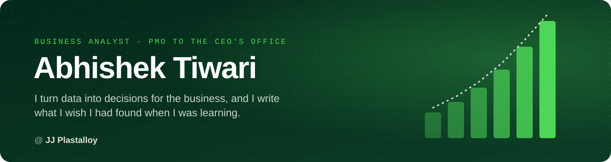

<h3 align="center">Hi, I'm Abhishek 👋 · Business Analyst · PMO (CEO's Office) at JJ Plastalloy</h3>

I turn data into decisions for the business, and I write what I wish I had found when I was learning.

  
  
  
  

---

## ⭐ Featured: Manufacturing Costing Engine

<b>Built at work · a working system</b>

What I do best: take a process that runs on a fragile spreadsheet and turn it into a system people can trust. This is the clearest example.

| Before | After |
|---|---|
| Product costs partly typed in by hand in one large Excel sheet | **Every cost derived from raw-material prices and recipes, never typed** |
| A price change meant hunting through every product that used it | **Change one price and every affected product recalculates at once** |
| "What if this price goes up?" meant copying the sheet and editing it by hand | **Impact analysis shows every affected product, old cost against new, before anything is saved** |
| Nobody could say who changed a number, when, or why | **Every change logged with who, when, old value, new value and the reason** |
| No checks: a recipe could total 99.5% or a bad paste could slip in unnoticed | **Recipes must total 100%, uploads are checked all-or-nothing, six user roles, 62 automated tests** |

<a href="portfolio/projects/costing-engine/README.md">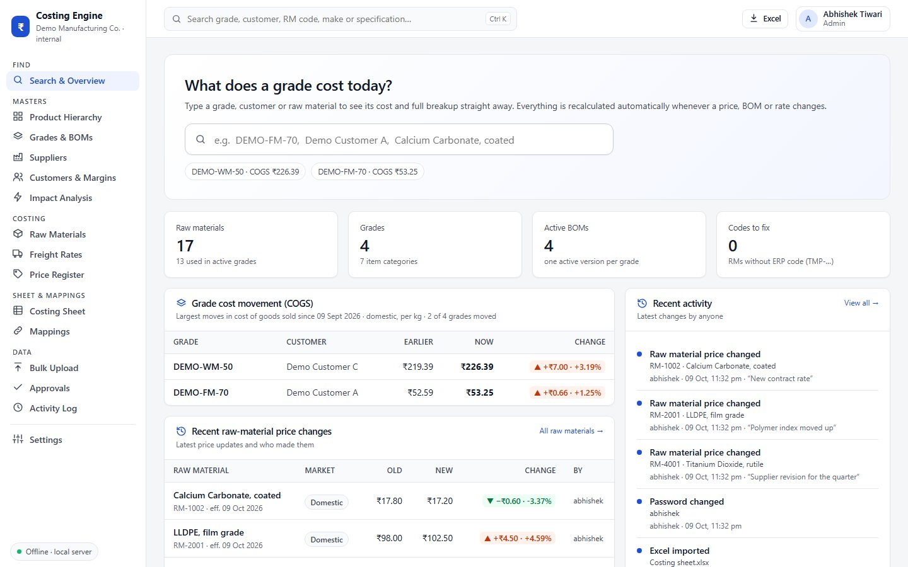</a> Search &amp; overview: what a product costs today, and what moved

<table>
<tr><td width="50%" align="center" valign="top"><a href="portfolio/projects/costing-engine/README.md">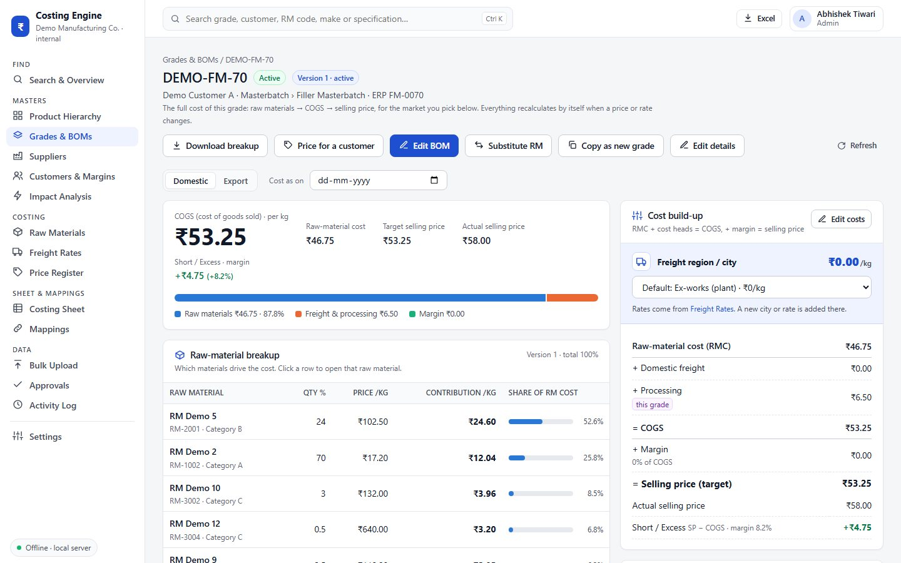</a> One product's full cost build-up</td><td width="50%" align="center" valign="top"><a href="portfolio/projects/costing-engine/README.md">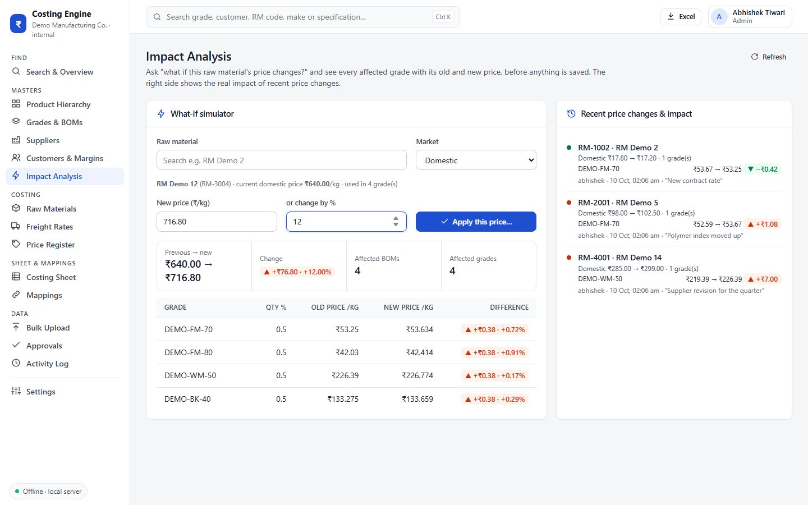</a> What-if: a price change and every product it touches</td></tr>
<tr><td width="50%" align="center" valign="top"><a href="portfolio/projects/costing-engine/README.md">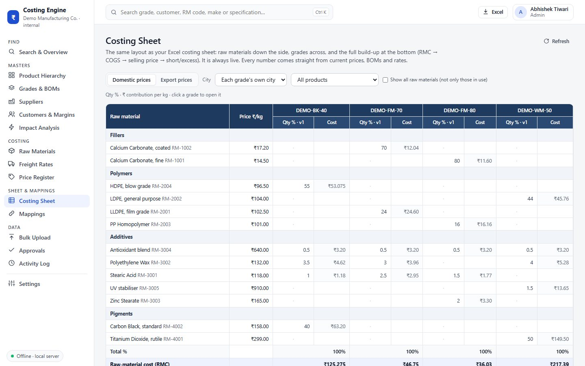</a> The familiar costing sheet, now live</td><td width="50%" align="center" valign="top"><a href="portfolio/projects/costing-engine/README.md">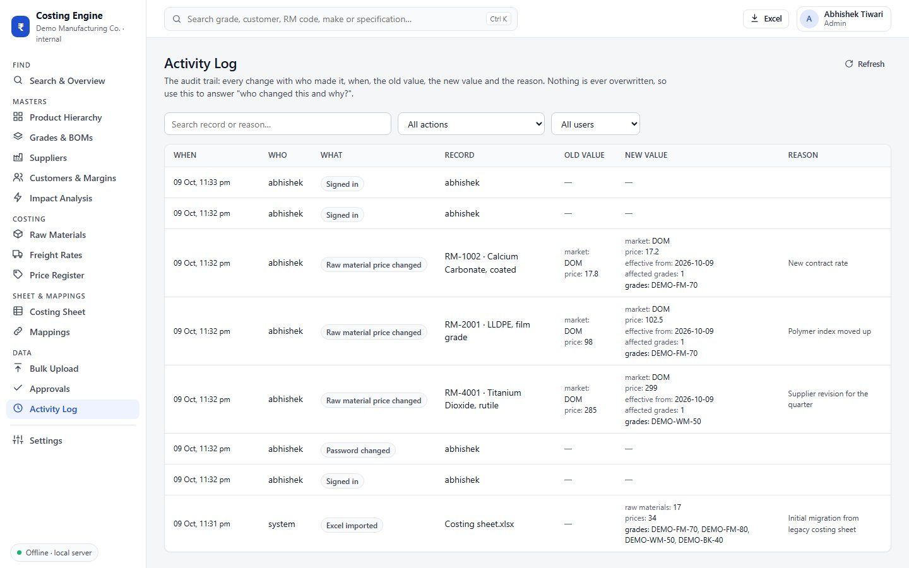</a> Audit trail: who changed what, and why</td></tr>
</table>

`Python · FastAPI · SQLAlchemy · SQLite · openpyxl · pytest · runs fully offline`

**[Read the full case study →](portfolio/projects/costing-engine/README.md)**

Screenshots use made-up demo data. The company's products, customers and prices are not shown.

---

## 🛒 Books &amp; projects on Compounza

<table><tr><td width="25%" align="center" valign="top"> <b>The Interview Readiness Book</b> ₹500</td><td width="25%" align="center" valign="top"> <b>Vol 1 · First Principles</b> 3 volumes ₹1,000</td><td width="25%" align="center" valign="top"> <b>Vol 2 · The Working Analyst</b> 3 volumes ₹1,000</td><td width="25%" align="center" valign="top"> <b>Vol 3 · Builder to Architect</b> 3 volumes ₹1,000</td></tr></table>

**Everything (all 4 books) ₹1,299** · [Read a free sample](https://compounza.in/read-free) · [Hands-on data projects](https://compounza.in/projects) · [Shop →](https://compounza.in)

---

<h3 align="center"><code>abhishekvtiwari@github ~ $ whoami</code></h3>

  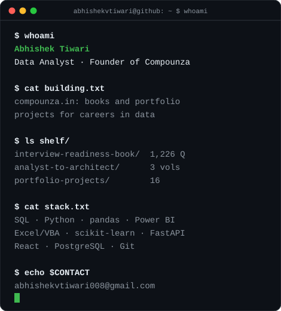
  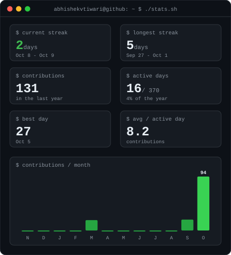

<h3 align="center"><code>abhishekvtiwari@github ~ $ ./contributions.sh</code></h3>

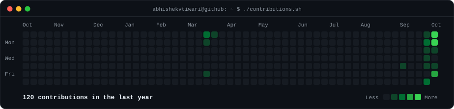

---

## 📂 Projects

<table>
<tr><td width="25%"><a href="portfolio/projects/p0-branch-sales-dashboard/README.md">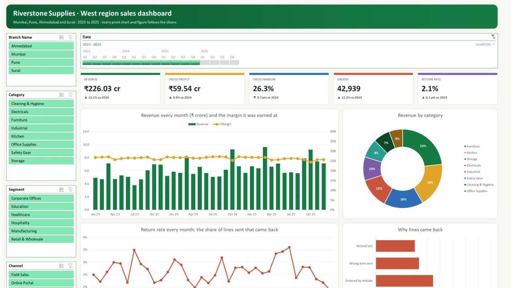</a></td><td width="25%"><a href="portfolio/projects/k1-monday-sales-briefing/README.md">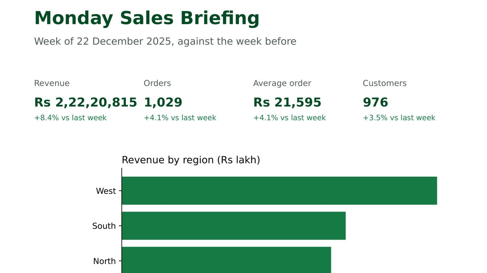</a></td><td width="25%"><a href="portfolio/projects/m1-mortgage-approval-model/README.md">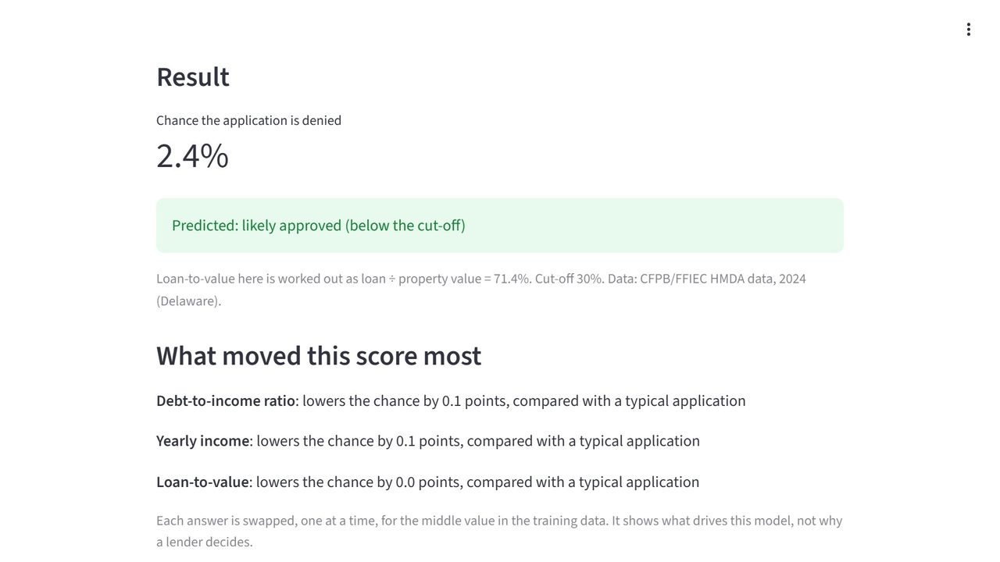</a></td><td width="25%"><a href="portfolio/projects/v4-hand-and-head-gesture-control/README.md">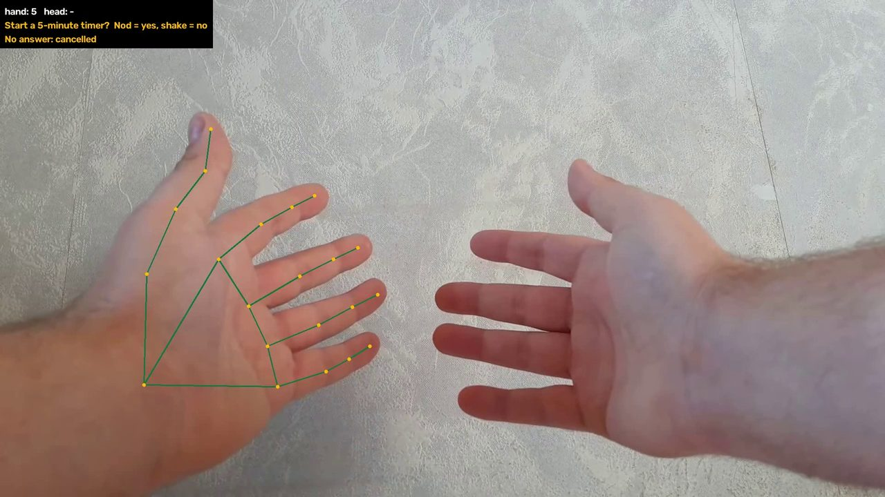</a></td></tr>
<tr><td width="25%"><a href="portfolio/projects/p05-monthly-sales-report-automation/README.md">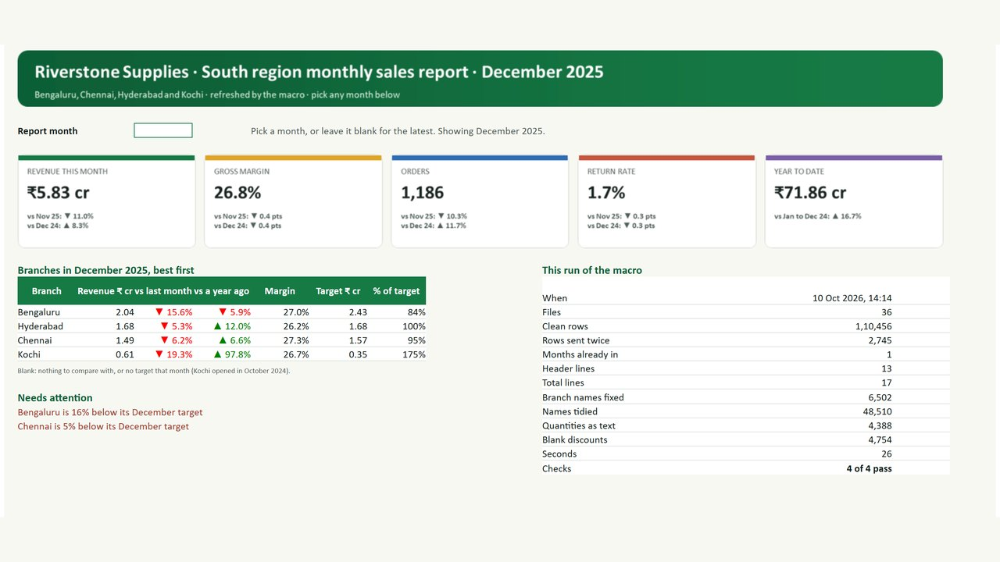</a></td><td width="25%"><a href="portfolio/projects/k2-dataset-fitness-check/README.md">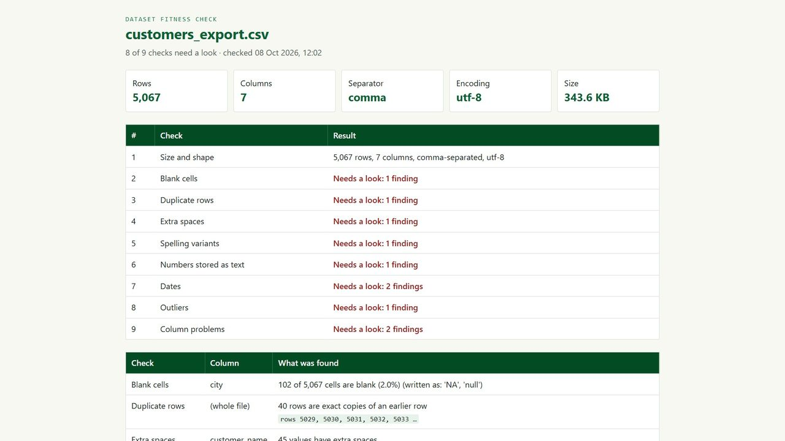</a></td><td width="25%"><a href="portfolio/projects/m5-b2b-account-health-and-order-risk/README.md">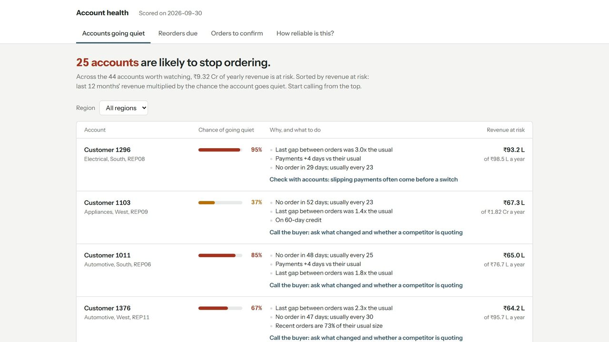</a></td><td width="25%"></td></tr>
</table>

**16 data projects across Excel, Python, machine learning and computer vision** → **[See all projects](portfolio/README.md)**

## 🙋 About me

- Business Analyst in the PMO (CEO's Office) at JJ Plastalloy.
- I work with SQL, Python, Power BI and Excel/VBA.
- Always learning, and writing down what I learn so others can learn it faster.

## 🌱 My personal project: Compounza

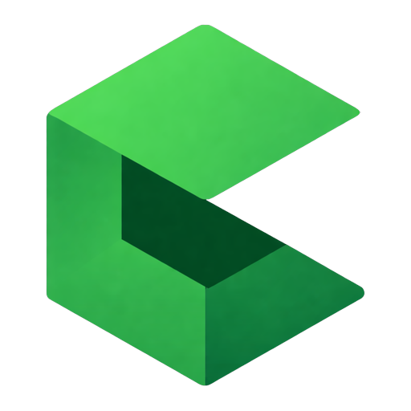

I took course after course and still didn't find what I was actually looking for, so I built it. Compounza is my experiment in learning by writing - books and projects that answer exactly what you need to know, and what to prepare for.

- 📘 The Interview Readiness Book - 1,226 data-science interview questions in 16 banks, 863 pages
- 📚 Analyst to Architect - three volumes, 68 chapters, 2,997 pages, from what data is to data architecture
- 🧩 16 portfolio projects - Excel, Python, machine learning and computer vision

**→ [compounza.in](https://compounza.in)**

## 🛠️ Skills

<table>
<tr><td><b>Business</b></td><td>    </td></tr>
<tr><td><b>Data</b></td><td>        </td></tr>
<tr><td><b>Tools</b></td><td>  </td></tr>
<tr><td><b>Also</b></td><td>    </td></tr>
</table>

## 📌 More projects

| Project | What it is | Built with |
|---|---|---|
| [**Compounza Financial Calculators**](https://github.com/abhishekvtiwari/compounza) | SIP, EMI, compound and simple interest calculators with charts, amortization schedules and a Smart Advisor health check | HTML · CSS · JavaScript |
| [**IPL Performance Dashboard**](https://github.com/abhishekvtiwari/Power-BI-IPL) | Team win rates, run rate over time, runs by batting position and year-on-year batsman trends | Power BI · DAX |
| [**Email to ClickUp Automation**](https://github.com/abhishekvtiwari/Email_to_Clickup_Task_Automation) | Reads an inbox, routes operational emails to ClickUp as tasks, never sends twice, keeps an audit trail | Python · pandas · IMAP/SMTP |
| [**BookYourMovie.com**](https://github.com/abhishekvtiwari/BookYourMovie.com) | Cinema booking with a live seat map, tiered pricing, a food add-on and box-office statistics | Python · OOP |
| [**Edyoda Gym Manager**](https://github.com/abhishekvtiwari/Edyoda-Gym-MMP) | Admin and member roles, member CRUD and BMI-based workout plans | Python · OOP |
| [**Bank Account Manager**](https://github.com/abhishekvtiwari/Bank-Account-Manager-Python-) | Checking, saving and business accounts, deposits, ATM withdrawals and PIN-checked customers | Python · OOP |
| [**Tic-Tac-Toe**](https://github.com/abhishekvtiwari/Tic_Tac_Toe---TK) | Two-player desktop game with win and tie detection | Python · Tkinter |

## 🤝 Let's connect

📫 **abhishekvtiwari008@gmail.com** · 💼 [LinkedIn](https://www.linkedin.com/in/abhishekvtiwari/) · 📄 [Résumé](https://drive.google.com/file/d/1YoB8_pJvyruGLlQiU17ai5iSiybyUXEY/view?usp=sharing) · 🌐 [compounza.in](https://compounza.in)

