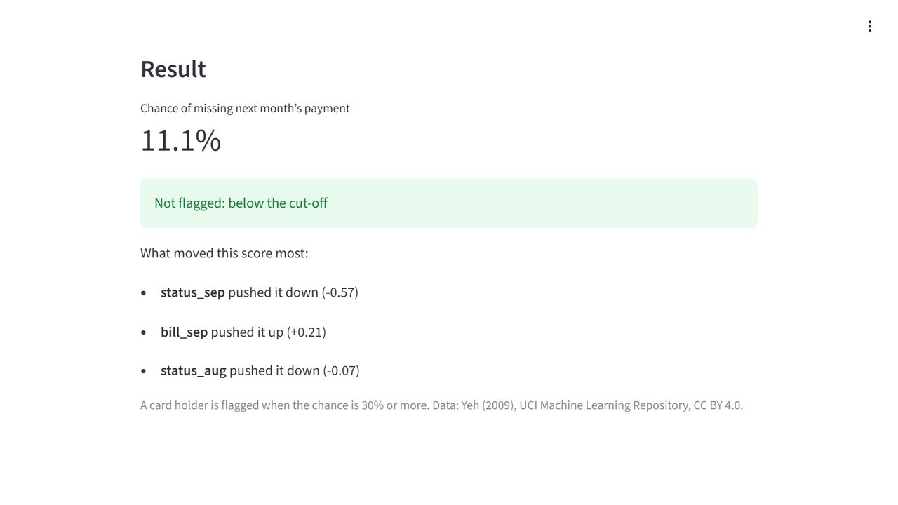
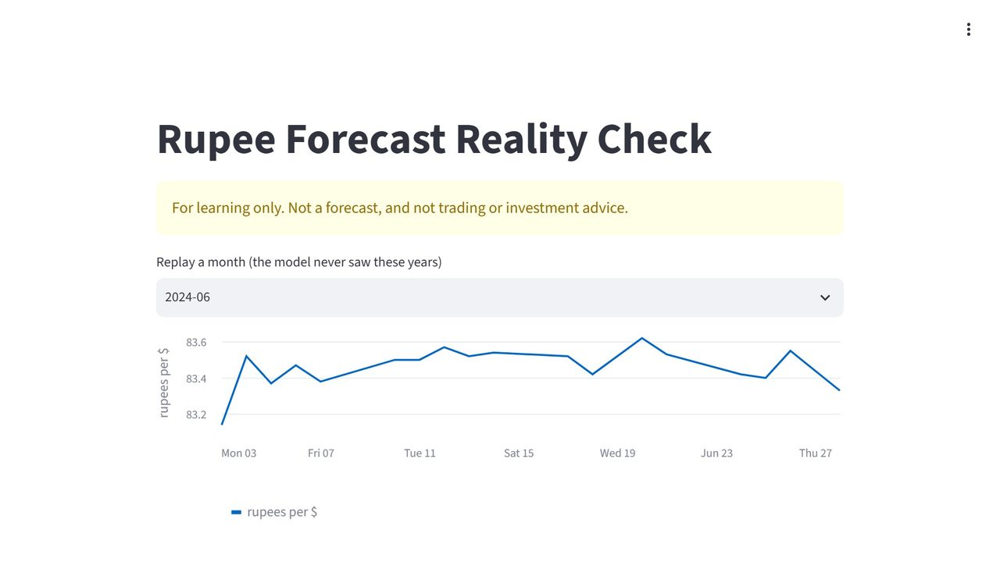
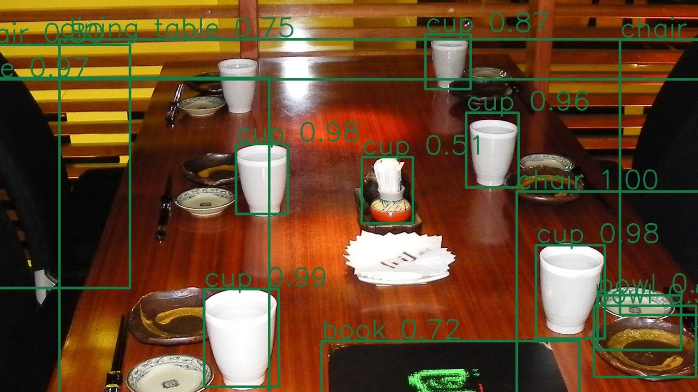

<h1 align="center">Projects Portfolio</h1>

<b>A costing system I built at work, and 16 end-to-end data projects I designed and built alongside my full-time role as a Business Analyst: Excel dashboards and automation, Python tools, machine-learning models and computer vision.</b>

  
  
  

Every project starts from a business question, works on real or realistically messy data, ends with a finished result I can demo, and comes with the interview questions it prepares me to answer. Each page below is a short case study: what I built, the tools, the skills, the data, and three of those interview answers.

---

## ⭐ Built at work

| | |
|---|---|
| **[Manufacturing Costing Engine](projects/costing-engine/README.md)** | A web app that replaced the company's costing spreadsheet: every product cost derived from raw-material prices and recipes, recalculated automatically, with impact analysis, versioning, six user roles and a full audit trail. Python · FastAPI · SQLAlchemy · 62 automated tests · fully offline. |

## 🗂️ Data projects

<table>
<tr>
<td width="25%" valign="top"> <b>P0</b> · <a href="projects/p0-branch-sales-dashboard/README.md"><b>Branch Sales Dashboard</b></a></td>
<td width="25%" valign="top"> <b>P0.5</b> · <a href="projects/p05-monthly-sales-report-automation/README.md"><b>Monthly Sales Report Automation</b></a></td>
<td width="25%" valign="top"> <b>P1</b> · <a href="projects/p1-pune-branch-sales-review/README.md"><b>Pune Branch Sales Review</b></a></td>
<td width="25%" valign="top"> <b>K1</b> · <a href="projects/k1-monday-sales-briefing/README.md"><b>Monday Sales Briefing</b></a></td>
</tr>
<tr>
<td width="25%" valign="top"> <b>K2</b> · <a href="projects/k2-dataset-fitness-check/README.md"><b>Dataset Fitness Check</b></a></td>
<td width="25%" valign="top"> <b>K3</b> · <a href="projects/k3-why-indian-billionaires-dont-rank-up/README.md"><b>Why Indian Billionaires Don't Rank Up</b></a></td>
<td width="25%" valign="top"> <b>K4</b> · <a href="projects/k4-economies-of-scale-cost-study/README.md"><b>Economies of Scale Cost Study</b></a></td>
<td width="25%" valign="top"> <b>M1</b> · <a href="projects/m1-mortgage-approval-model/README.md"><b>Mortgage Approval Model</b></a></td>
</tr>
<tr>
<td width="25%" valign="top"> <b>M2</b> · <a href="projects/m2-card-default-risk-model/README.md"><b>Card Default Risk Model</b></a></td>
<td width="25%" valign="top"> <b>M3</b> · <a href="projects/m3-home-loan-rate-model/README.md"><b>Home Loan Rate Model</b></a></td>
<td width="25%" valign="top"> <b>M4</b> · <a href="projects/m4-rupee-forecast-reality-check/README.md"><b>Rupee Forecast Reality Check</b></a></td>
<td width="25%" valign="top"> <b>V1</b> · <a href="projects/v1-road-traffic-count-and-speed-survey/README.md"><b>Road Traffic Count and Speed Survey</b></a></td>
</tr>
<tr>
<td width="25%" valign="top"> <b>V2</b> · <a href="projects/v2-bystander-face-redaction/README.md"><b>Bystander Face Redaction</b></a></td>
<td width="25%" valign="top"> <b>V3</b> · <a href="projects/v3-live-object-inventory/README.md"><b>Live Object Inventory</b></a></td>
<td width="25%" valign="top"> <b>V4</b> · <a href="projects/v4-hand-and-head-gesture-control/README.md"><b>Hand and Head Gesture Control</b></a></td>
<td width="25%" valign="top"> <b>M5</b> · <a href="projects/m5-b2b-account-health-and-order-risk/README.md"><b>B2B Account Health and Order Risk</b></a></td>
</tr>
</table>

## 📊 Excel & guided builds

Messy business data turned into dashboards and one-click reports, in Excel, VBA and Python.

| | Project | What it does | Tools |
|---|---|---|---|
| **P0** | [Branch Sales Dashboard](projects/p0-branch-sales-dashboard/README.md) | Turn three years of messy sales into a clickable dashboard, and find out why goods are coming back. | Excel 2021, 2024 or Microsoft 365 (paid) |
| **P0.5** | [Monthly Sales Report Automation](projects/p05-monthly-sales-report-automation/README.md) | One click imports three years of messy monthly files and refreshes a monthly report you can turn to any month; you write four parts of the macro. | Excel on Windows (2021, 2024 or Microsoft 365, paid) · VBA |
| **P1** | [Pune Branch Sales Review](projects/p1-pune-branch-sales-review/README.md) | Clean three years of company sales in Python, find why Pune’s profit fell behind, and build your own Streamlit page. | Python · pandas · Plotly · Streamlit · Jupyter |

## 🧰 Python automation kits

Small tools that do a recurring job: a weekly briefing, a data-quality check, a cost study.

| | Project | What it does | Tools |
|---|---|---|---|
| **K1** | [Monday Sales Briefing](projects/k1-monday-sales-briefing/README.md) | One command turns a sales file into a weekly briefing, ready to email. | Python · pandas · openpyxl · matplotlib · Outlook (Gmail optional) · Jupyter |
| **K2** | [Dataset Fitness Check](projects/k2-dataset-fitness-check/README.md) | Point it at any CSV file and get a one-page report of its problems. | Python · pandas · Jupyter |
| **K3** | [Why Indian Billionaires Don't Rank Up](projects/k3-why-indian-billionaires-dont-rank-up/README.md) | See why Indian fortunes grow fast in rupees but barely climb the world rich list. | Python · pandas · matplotlib · Jupyter |
| **K4** | [Economies of Scale Cost Study](projects/k4-economies-of-scale-cost-study/README.md) | Measure exactly why each product gets cheaper the more you make. | Python · pandas · matplotlib · Excel 2016 or newer (paid) · Jupyter |

## 🤖 Machine learning

Models built and tested honestly on public data, each with a small app to score a new case.

| | Project | What it does | Tools |
|---|---|---|---|
| **M1** | [Mortgage Approval Model](projects/m1-mortgage-approval-model/README.md) | Find the leak that fakes a perfect score, then take a first fairness look at a lending model. | Python · pandas · scikit-learn · Streamlit · Jupyter |
| **M2** | [Card Default Risk Model](projects/m2-card-default-risk-model/README.md) | The credit dataset everyone uses, done the way a bank would. | Python · pandas · scikit-learn · Streamlit · Jupyter |
| **M3** | [Home Loan Rate Model](projects/m3-home-loan-rate-model/README.md) | Predict a US home loan’s interest rate (Delaware, 2024, US$), with a range, and turn it into a payment. | Python · pandas · scikit-learn · Streamlit · Jupyter |
| **M4** | [Rupee Forecast Reality Check](projects/m4-rupee-forecast-reality-check/README.md) | Put a rupee forecast to the test: catch the leak that fakes 84%, and prove whether 51% beats luck. | Python · pandas · scikit-learn · Streamlit · Jupyter |
| **M5** | [B2B Account Health and Order Risk](projects/m5-b2b-account-health-and-order-risk/README.md) | Three models that tell a sales team whom to call, what to expect and which orders to confirm. | Python · pandas · XGBoost · SHAP · Flask · Jupyter |

## 👁️ Computer vision

Video and webcam projects that count, blur, recognise and react, running on your own computer.

| | Project | What it does | Tools |
|---|---|---|---|
| **V1** | [Road Traffic Count and Speed Survey](projects/v1-road-traffic-count-and-speed-survey/README.md) | Count the vehicles and people passing a camera, estimate their speed, and flag the speeders. | Python · OpenCV · PyTorch · torchvision · Jupyter |
| **V2** | [Bystander Face Redaction](projects/v2-bystander-face-redaction/README.md) | Blur the faces in photos and videos before you share them. | Python · OpenCV · YuNet · Jupyter |
| **V3** | [Live Object Inventory](projects/v3-live-object-inventory/README.md) | Point a camera at a room or a road: it names and counts the objects it sees. | Python · PyTorch · torchvision · OpenCV · Jupyter |
| **V4** | [Hand and Head Gesture Control](projects/v4-hand-and-head-gesture-control/README.md) | Run a timer, turn slides and pause music with your hands and head, through a webcam. | Python · MediaPipe · OpenCV · Jupyter |

## 🧰 Tools across the portfolio

`Excel 2016 or newer (paid)` · `Excel 2021, 2024 or Microsoft 365 (paid)` · `Excel on Windows (2021, 2024 or Microsoft 365, paid)` · `Flask` · `Jupyter` · `MediaPipe` · `OpenCV` · `Outlook (Gmail optional)` · `Plotly` · `PyTorch` · `Python` · `SHAP` · `Streamlit` · `VBA` · `XGBoost` · `YuNet` · `matplotlib` · `openpyxl` · `pandas` · `scikit-learn` · `torchvision`

## 🔜 Next

The next data project is in progress and will be added here when it is finished.

---

Case studies only: the full projects (guides, data, notebooks and solutions) are on <a href="https://compounza.in/projects">compounza.in</a> · <a href="https://github.com/abhishekvtiwari">Abhishek Tiwari</a>

