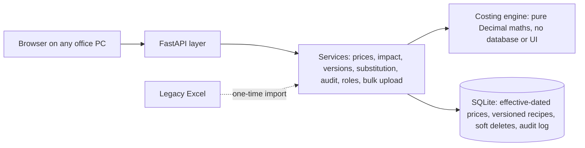

# Manufacturing Costing Engine

> A web application that replaced a manufacturing company's costing spreadsheet: every product's cost is calculated from raw-material prices and recipes, recalculates itself when a price changes, and keeps a full history of who changed what.

**Built at work** · Python · FastAPI · SQLAlchemy · SQLite · 62 automated tests · runs fully offline on the office network

<sub>This is a case study. The working system, its data, product names and prices belong to the company and are not shared here. The screenshots below run the same application on made-up demo data.</sub>

<p align="center"><br><sub>Search &amp; overview: what a product costs today, and what moved</sub></p>

---

## The problem

Costing lived in one large Excel sheet. Product costs were partly typed in by hand, so when a raw-material price changed, someone had to find and update every product that used it, and nobody could say afterwards who changed a number, when, or why. A wrong cost means a wrong quote to a customer.

## What I built

An internal costing platform where **a product's cost is never typed in, only derived**:

```
Raw-material cost   = Σ (quantity % × raw-material price)
+ Freight           (domestic: by city or region · export: per shipment, converted from USD)
+ Processing        (set per product family; a product can override)
= Cost of goods sold
+ Margin            (% or ₹/kg; per product, customer or grade)
= Target selling price          → actual price − cost = profit or shortfall
```

| Area | What it does |
|---|---|
| **Search & overview** | Type a product, customer or material and see the cost and its full breakdown at once |
| **Costing sheet** | The familiar spreadsheet layout, but live: materials down the side, products across, the cost build-up at the bottom |
| **Recipes (formulations)** | Edit a recipe with a live cost, substitute one material for another, copy a recipe into a new product, compare versions. A recipe that doesn't total 100% is refused |
| **Raw materials** | Prices with full history and a landed-price breakdown (basic + freight + duty + other), suppliers, tax codes |
| **Impact analysis** | "What if this price changes?": every affected product, old cost against new, **before** anything is saved |
| **Product hierarchy** | Item type → category → group → product, with processing cost and default margin inherited down the levels |
| **Bulk upload** | Templates for prices, materials, suppliers, recipes, freight and margins. The whole file is checked first and saved **all or nothing**; near-misses get a suggested fix |
| **Activity log** | Who, what, when, old value, new value and the reason, for every change |
| **Roles** | Admin, costing manager, purchase, management, sales and viewer, each seeing only the actions they're allowed |

## Screens

<table>
<tr><td width="50%" align="center" valign="top"><br><sub>One product's full cost build-up: raw materials, freight, processing, margin</sub></td><td width="50%" align="center" valign="top"><br><sub>What-if: a 12% price rise and every product it touches, before saving</sub></td></tr>
<tr><td width="50%" align="center" valign="top"><br><sub>The familiar costing-sheet layout, now live</sub></td><td width="50%" align="center" valign="top"><br><sub>Audit trail: who, when, old value, new value and the reason</sub></td></tr>
</table>

## How it's built



- **The engine is separate and pure:** a calculator with exact `Decimal` arithmetic and no database or screen code, fully unit-tested. The screens never calculate; they ask the services, which ask the engine.
- **Nothing is overwritten:** prices are **effective-dated** (each has a start date), recipes are **versioned**, and records are soft-deleted. Past costs can always be reproduced.
- **Offline by design:** one office PC runs the app; other PCs open it in a browser over the local network. It carries its own Python runtime and libraries, so nothing needs installing or downloading.
- **Safe updates:** an update package backs up the data, tries the new version on a copy first, keeps the previous version and **rolls back by itself** if anything fails. Automatic and one-click backups.
- **Live refresh:** pages update within seconds when someone else saves, without losing what you're typing.

## How I made sure it's right

- **62 automated tests** across the engine and the services, run before every release.
- **Acceptance test with a deliberately messy file:** codes with stray spaces and Excel's invisible non-breaking spaces, a recipe totalling 99.5%, a material listed twice, text in a number column, a category spelled slightly wrong. Every problem was caught with a plain-English message, the database stayed unchanged until the file was clean, and a simulated failure halfway through a save undid the whole upload.
- **Reconciled against the spreadsheet** it replaced, with every difference explained.

## Tools

`Python 3.12` · `FastAPI` · `SQLAlchemy 2` · `SQLite` · `Pydantic` · `openpyxl` · `pytest` · `HTML/CSS/JavaScript (no internet libraries)`

## Skills shown

- Turning a business spreadsheet into a reliable, auditable system
- Data modelling: effective dating, versioning, soft deletes, many-to-many masters
- Layered architecture with a pure, tested calculation engine
- Validation design: all-or-nothing imports with suggested fixes
- Role-based access and audit trails
- Offline deployment, update packages, backups and rollback
- Requirements gathering with costing, purchase, sales and management users

## Interview questions this project answers

<details>
<summary><b>Why use Decimal instead of float for costs?</b></summary>

Floats store numbers in binary, so 0.1 + 0.2 is not exactly 0.3. Across many materials, freight and margins those tiny errors add up and a cost stops matching the spreadsheet by a few paise. Python's `Decimal` does exact decimal arithmetic with controlled rounding, so a cost calculated twice is always identical, and matches what a person checks by hand.
</details>

<details>
<summary><b>How do you change a price without losing the old costs?</b></summary>

Prices are never overwritten. Each new price is a new row with an effective date, and recipes are versioned the same way. Today's cost uses the prices in force today; any past cost can be rebuilt from the prices and recipe that applied then. Every change also lands in an append-only audit log with the old value, the new value and the reason.
</details>

<details>
<summary><b>Why is the bulk upload "all or nothing"?</b></summary>

A half-applied price file is worse than none: some products show new costs and some old, and nobody can tell which. So the whole file is checked first and every problem listed. Saving happens in one database transaction, so if anything fails partway, everything is rolled back. The user fixes the file, or ticks a suggested fix, and tries again.
</details>

---

**Full project page, screens and the source code offer: [manufacturing-costing-engine](https://github.com/abhishekvtiwari/manufacturing-costing-engine)**

[← All projects](../../README.md)
