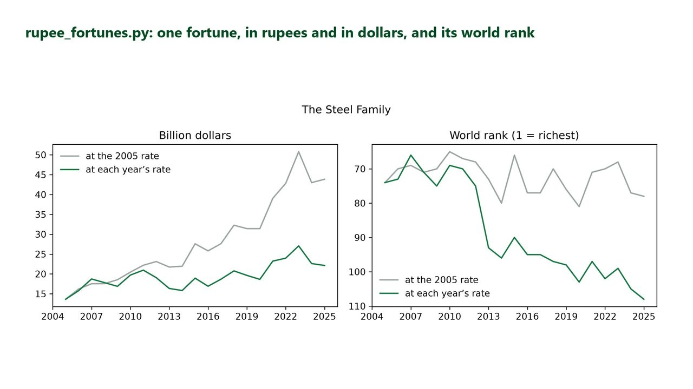

# K3 · Why Indian Billionaires Don't Rank Up

> See why Indian fortunes grow fast in rupees but barely climb the world rich list.

A chart drawn by the project's rupee_fortunes.py (saved at 300 dpi for this picture), on its made-up fortunes and the US Federal Reserve's rupee-dollar rates (H.10).

## What I built

I built a Python tool that converts rupee fortunes into dollars, year by year, with the US Federal Reserve's exchange rates, ranks them against a world list, and separates real growth from the currency effect. The rupee averaged 44.00 per dollar in 2005 and 87.15 in 2025, so a rupee fortune had to grow x1.98 just to stay the same size in dollars. Rich lists are written in dollars, which is why a fortune can grow fast at home and still slip down the world ranking.

A Python tool converts rupee fortunes to dollars with the US Federal Reserve’s real exchange rates, ranks them against a world list, and separates real growth from the effect of the falling rupee. The fortunes are made up; the exchange rates are real.

## Tools

`Python` · `pandas` · `matplotlib` · `Jupyter`

## Skills shown

- Joining and converting time series in pandas
- Ranking and comparing like with like
- A counterfactual: what if the rate had stayed the same?
- Charts that make one point clearly

## Data

- Made-up fortunes; no real person or company (made up and owned by Compounza)
- Board of Governors of the Federal Reserve System, H.10 (public domain)

## Interview questions this project answers

<b>What data did you use?</b>

The 8 Indian fortunes, in crore rupees from 2005 to 2025, and the 120 fortunes abroad, in billion dollars, are made up for the project: no real person, family or company. The exchange rates are real: 6,702 trading days of rupees per dollar, 2000-01-03 to 2026-09-25, from the Federal Reserve's H.10 release, which is public domain. Days marked as no data were left out, and no rate was changed.

<b>Why use the year's average rate, and when would the year-end rate be better?</b>

A fortune is worth something across the whole year, so the average of every trading day stops one unusual day from deciding the answer. The year-end rate fits better when a list is a snapshot on one date. I ran it both ways: with year-end rates a fortune had to grow x2.00 instead of x1.98, and the Pharma Founder's 2025 rank was 71 with year-end rates against 69 with averages. The detail can change, the story does not.

<b>What does "at the start year's rate" mean, and why is it a fair comparison?</b>

I convert every year's rupees at the 2005 rate as well as at that year's own rate. It is the same fortune and the same rupees, with only the exchange rate held still, so the gap between the two lines is the currency effect alone. The Software Founder ranked 60 in 2025, but would rank 24 at the 2005 rate.

---

**The full project** (step-by-step guide, data, notebook, the finished solution and all ten interview questions) is on [compounza.in](https://compounza.in/projects/k3-why-indian-billionaires-dont-rank-up).

[← All projects](../../README.md)
