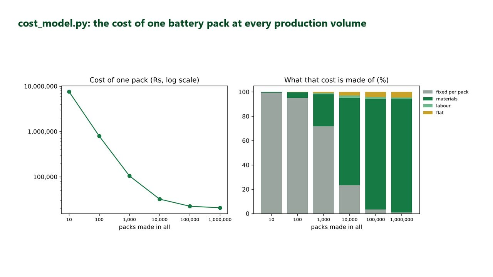

# K4 · Economies of Scale Cost Study

> Measure exactly why each product gets cheaper the more you make.

A chart drawn by the project's cost_model.py (saved at 300 dpi for this picture), on its stated assumptions.

## What I built

I built a cost model, in Python and in Excel, for a made-up company's 2 kWh battery pack, taken from research and prototypes to mass production. One pack costs Rs 75,90,333 if only 10 are made and Rs 20,713 each at 10,00,000, and I take that gap apart line by line. It answers the two questions an investor asks: what a pack will cost at scale, and how many must be sold to break even, which is 8,535 packs at Rs 38,000.

Follow a made-up battery pack from research and prototypes to mass production. The Excel half needs Excel 2016 or newer (paid); it was tested only in Microsoft 365 on Windows.

## Tools

`Python` · `pandas` · `matplotlib` · `Excel 2016 or newer (paid)` · `Jupyter`

## Skills shown

- Cost modelling: fixed and per-unit costs
- Fitting a learning curve from data
- Break-even and scenario analysis in Excel with live formulas
- Comparing a business idea with real public data

## Data

- Riverstone Mobility, fictional (made up and owned by Compounza)
- U.S. Energy Information Administration, Form EIA-63B, Tables 3 and 4 (public domain)

## Interview questions this project answers

<b>What data did you use?</b>

The company, Riverstone Mobility, and all its cost sheets are made up: realistic in shape, not real quotes. They are the fixed costs (Rs 7,55,00,000 paid once), the supplier price list with cheaper prices for bigger orders, flat costs per pack, the assumptions, and 36 months of production records. The one real file is US Energy Information Administration solar module prices, 2006 to 2022, which are public domain.

<b>Which costs fall with volume, and which do not?</b>

Fixed costs fall per pack because they are shared over more packs. Materials step down at each bulk-discount tier, from Rs 36,300 to Rs 19,340 a pack, and labour falls as workers learn. Flat costs, such as warranty reserve and freight to dealer, stay at Rs 950 a pack at any volume. So fixed costs are 71.9% of the cost at 1,000 packs, while materials are 93.4% at 10,00,000.

<b>What is a learning rate, and how did you measure it?</b>

A learning rate of 85% means that each time total output doubles, a pack takes 85% of the time it took before. I took the production records, worked out hours per pack each month, and fitted a straight line to the log of hours against the log of packs already made. It came out at 84.9%, and the made-up records had been created with 85% plus noise, so recovering it was a check that the method works.

---

**The full project** (step-by-step guide, data, notebook, the finished solution and all ten interview questions) is on [compounza.in](https://compounza.in/projects/k4-economies-of-scale-cost-study).

[← All projects](../../README.md)
