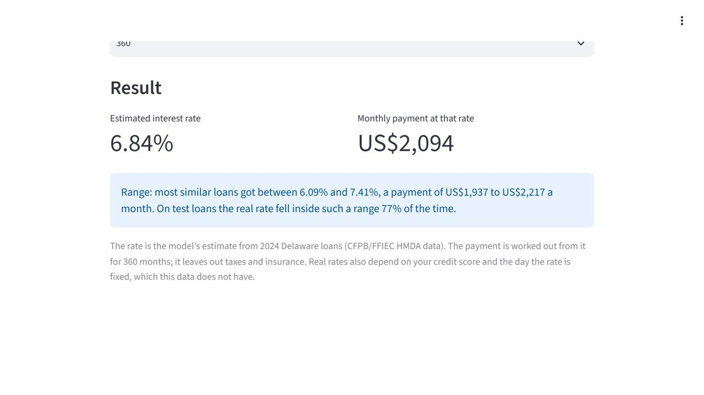

# M3 · Home Loan Rate Model

> Predict a US home loan’s interest rate (Delaware, 2024, US$), with a range, and turn it into a payment.

Screenshot of the project's own app.py, running on public HMDA mortgage records, Delaware 2024 (CFPB/FFIEC).

## What I built

I built a regression model that predicts the interest rate of a home loan from the loan and the borrower's finances, trained on 13,945 real loans made in Delaware in 2024. The brief, a fictional one, was a mortgage adviser whose customers ask what rate they will get before they apply. My Streamlit app turns the estimate into a monthly payment: for the made-up FHA refinance example it shows 5.94%, about US$1,489 a month. It is for learning only, not a rate quote.

A small app turns the rate and its range into a monthly payment. A page on how Indian home-loan rates are set (an RBI benchmark plus a credit-risk spread) shows what carries over to an Indian bank and what does not.

## Tools

`Python` · `pandas` · `scikit-learn` · `Streamlit` · `Jupyter`

## Skills shown

- Regression with scikit-learn
- A baseline to beat, and how often the model is close
- Prediction ranges with quantile models
- A Streamlit app with a loan-payment formula

## Data

- CFPB/FFIEC HMDA public data, 2024 (public domain (US government work))

## Interview questions this project answers

<b>Tell me about the data.</b>

It is public HMDA data for 2024 from the CFPB and FFIEC, published for public use under US law, so it is a US government work in the public domain with no names or addresses. Of 48,786 Delaware records I kept 13,945: first-lien loans for the borrower's own single-family home, to buy or refinance, that were made and have a rate. Rates run from 2.25% to 12.5%, but half sit between 6.00% and 6.99%. Debt-to-income comes as a mix of bands and whole numbers; after I turned them into one number, 13,298 loans had a value.

<b>Why compare with guessing the median rate?</b>

Any model has to beat the simplest guess, or it is not worth having. Guessing the median rate of the training loans for everyone is off by 0.561 points on average. I also tried guessing the mean, which was off by 0.562, so the median is the better simple guess when you measure the average distance. Without that bar, nobody can tell whether my model's error is good.

<b>What does "off by so many points on average" mean?</b>

It is the mean absolute error: for each test loan I take the gap between the predicted and the real rate, ignore the sign, and average it, in percentage points of interest. It is easy to explain, but an average can hide the spread, so I also counted how often the model is close: within 0.25 points for 35.4% of loans, within 0.5 points for 64.4% of loans, within 1.0 points for 90.8% of loans.

---

**The full project** (step-by-step guide, data, notebook, the finished solution and all ten interview questions) is on [compounza.in](https://compounza.in/projects/m3-home-loan-rate-model).

[← All projects](../../README.md)
