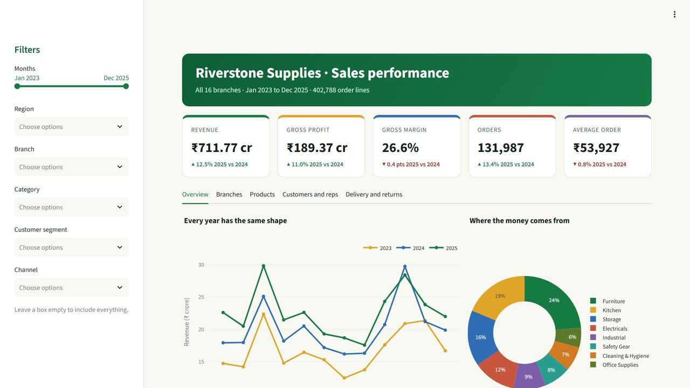

# P1 · Pune Branch Sales Review

> Clean three years of company sales in Python, find why Pune’s profit fell behind, and build your own Streamlit page.

Screenshot of the project's own dashboard.py, running on its made-up Riverstone Supplies sales data (no real company).

## What I built

The Pune branch manager was told Pune had a great 2025: sales up 16.0%. But profit did not feel like it. I took the whole company’s three-year sales export, 4,06,774 rows from 16 branches, cleaned it in pandas, compared Pune with the other branches, and found where the margin was going. Then I built a small Streamlit page of my own to compare branches, and used a supplied five-tab dashboard to explore the rest.

The whole sales export of a 16-branch company: 4.07 lakh rows over three years (2023–2025) with nine problems planted on purpose. Made-up company, made-up data.

## Tools

`Python` · `pandas` · `Plotly` · `Streamlit` · `Jupyter`

## Skills shown

- pandas: cleaning nine kinds of problem on 4 lakh rows, with a check after every step
- Finding the cause behind a number: growth against margin, then reps and discounts
- Writing a Streamlit page with a filter, metrics and a Plotly chart
- Exploring an interactive five-tab dashboard

## Data

- Riverstone Supplies sales, fictional (made up and owned by Compounza)

## Interview questions this project answers

<b>What was wrong with the data?</b>

Nine things: a week of March exported twice (3,908 rows), 78 test orders, day-first text dates, prices as text like "Rs. 13,660", 15,137 blank discounts, 14 spellings for 5 statuses, 54 spellings for 16 branches, customer names with stray spaces (11,447 names for 3,743 customers) and 7,856 delivery days written as -999. I counted each before and after its fix. The data is fictional, made by Compounza, with the problems planted on purpose.

<b>How did you know the dates were day first?</b>

Some dates, such as 13-01-2023, only make sense as day-month-year, because there is no month 13. If you force a month-first reading, 1,46,890 dates still come out as real-looking but wrong dates, with no warning. So I gave the format "%d-%m-%Y" and checked the range: 2023-01-01 to 2025-12-31, exactly three years.

<b>Why remove duplicates before adding anything up?</b>

Every copied row is a sale counted twice, so totals would be too high and that March week would look better than it was. drop\_duplicates removes only rows that match in every column, which matters because one order has several lines with the same Order ID. The count went from 4,06,774 to 4,02,866, exactly the 3,908 copies.

---

**The full project** (step-by-step guide, data, notebook, the finished solution and all ten interview questions) is on [compounza.in](https://compounza.in/projects/p1-pune-branch-sales-review).

[← All projects](../../README.md)
