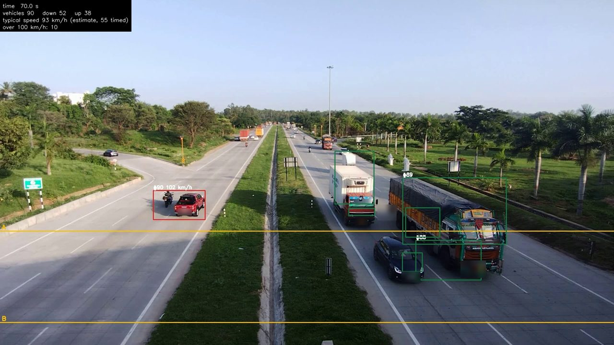

# V1 · Road Traffic Count and Speed Survey

> Count the vehicles and people passing a camera, estimate their speed, and flag the speeders.

Video: "NICE Road Clover leaf junction (2025) 04" by Gpkp, CC BY-SA 4.0, via Wikimedia Commons; boxes, lines and counts drawn by the project's speed_counter.py; number plates blurred for publication. This picture is CC BY-SA 4.0.

## What I built

It counts the vehicles passing a still camera, in each direction, estimates their speed and flags those over the limit, and with an AI detector also says what each one is: person, bicycle, motorbike, car, bus or lorry. The brief was a residents’ association that needs numbers for the ward office, not complaints. On a 79-second video of NICE Road in Bengaluru the simple counter found 99 vehicles, 12 of them over 100 km/h, and the AI survey 102.

Two tools on Indian roads. A no-AI OpenCV counter plays the video in a live window, counts each vehicle crossing a line by direction, estimates its speed between two lines a known distance apart, and flags any over the limit (default 100 km/h) with a snapshot, number plates blurred. A PyTorch detector counts by type: person, bicycle, motorbike, car, bus, lorry, with riders kept part of their bike. Practice video: 79 seconds of NICE Road, Bengaluru (CC BY-SA 4.0), in the zip; four more in full HD download from Wikimedia Commons with one command.

## Tools

`Python` · `OpenCV` · `PyTorch` · `torchvision` · `Jupyter`

## Skills shown

- Background subtraction and tracking with OpenCV
- Speed from two lines and a known distance, and a limit check
- Object detection with a pre-trained PyTorch model
- Checking two tools against one hand count

## Data

- "NICE Road Clover leaf junction (2025) 04" by Gpkp, Wikimedia Commons (CC BY-SA 4.0)
- "Cars driving at night", YouTube user Editor, Wikimedia Commons (CC BY 3.0)

## Interview questions this project answers

<b>What data did you use, and are you allowed to use it?</b>

A 79-second video of NICE Road, Bengaluru, filmed from an overpass in June 2025: "NICE Road Clover leaf junction (2025) 04" by Gpkp on Wikimedia Commons, licensed CC BY-SA 4.0, and a 30-second night clip, CC BY 3.0. I keep both credit lines. The AI detector’s weights download from PyTorch and were trained on the COCO images, so I would check their terms before any commercial use.

<b>How does the simple counter work, without AI?</b>

Six steps per frame. A light blur; OpenCV’s MOG2 compares the frame with a learned picture of the empty road and marks changes white and shadows grey; I drop the shadows and clean the patches; each patch big enough gets a box; each box is matched to the nearest box in the last frame; and a vehicle crossing line A is counted once. It read the whole video in 26 seconds on my laptop, and counted 99.

<b>How do you get a speed from a camera?</b>

Speed is distance over time. The time is measured: the seconds between a vehicle crossing line A and line B. The distance I read from the paint: India’s lane-marking standard, IRC:35-2015, gives a 3 m mark and a 6 m gap on a divided road, and there are two of those cycles between my lines, so 18 m. Metres divided by seconds, times 3.6, is km/h. The typical speed was 93 km/h. It is an estimate: I did not measure the road, and if the paint were different every speed would be off by the same share.

---

**The full project** (step-by-step guide, data, notebook, the finished solution and all ten interview questions) is on [compounza.in](https://compounza.in/projects/v1-road-traffic-count-and-speed-survey).

[← All projects](../../README.md)
